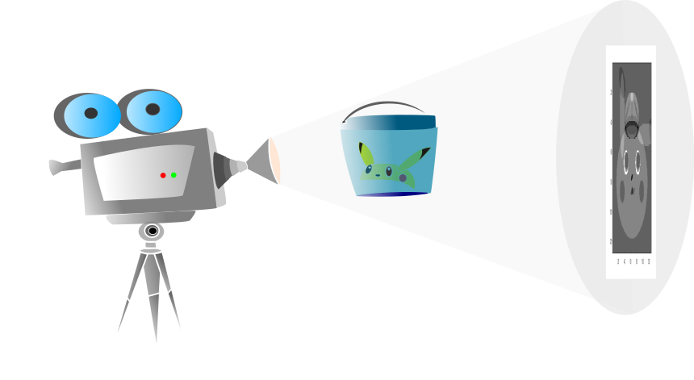

# Reconstruccion de imagenes

In this project i implemented some image reconstruction methods like filtered backprojection, ART, SIRT and SART. The implementations are by no means the most efficient, my goal was to understand them and follow closely the methodology described in Kak's book: Principles of Computerized Tomographic Imaging. I also implemented a very simple ConvNet for tumor detection. 

